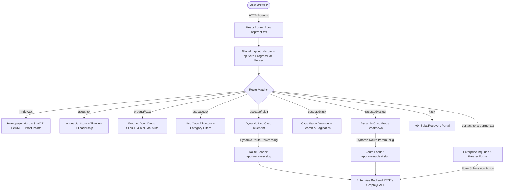

# Auggit &mdash; Enterprise Document Management & Automation Platform

[](https://reactrouter.com/)
[](https://tailwindcss.com/)
[](https://www.typescriptlang.org/)
[](https://www.framer.com/motion/)
[](https://vitejs.dev/)

Auggit is a next-generation corporate web platform and digital hub for enterprise document automation, compliance intelligence, and structured records management. It bridges transactional ERP systems and enterprise documents with automated indexing, sub-second retrieval, and automated audit trails.

---

## 🌟 Key Highlights & Product Ecosystem

- **a-eDMS (Electronic Document Management System)**:
  - Direct ERP integration linking financial transactions to physical document archives.
  - Sub-300ms retrieval speed for enterprise-scale record libraries.
  - Automated 70% reduction in external audit preparation overhead.
  - Comprehensive role-based access control (RBAC), immutable version logs, and approval workflows.

- **SLaiCE (Intelligent Document Processing & Extraction)**:
  - Deep-learning-assisted optical character recognition (OCR) and schema-aware data extraction.
  - High-confidence verification badges and validation routines.
  - Multi-page invoice, bill of lading, and contract parsing with zero data duplication.

- **Interactive Experience & Micro-Animations**:
  - Global real-time reading progress indicator (`ScrollProgressBar`).
  - Seamless viewport-triggered entrance animations powered by **Framer Motion**.
  - Interactive industry use cases, dynamic filterable case studies, and enterprise ROI calculators.

- **Developer-Grade Resilience & Error Boundaries**:
  - Full-stack error handling with root-level `ErrorBoundary` in `app/root.tsx`.
  - Splat route fallback (`app/routes/$.tsx`) for missing document trails.
  - Collapsible developer diagnostics in non-production environments.

---

## 🎨 Brand Design System & Color Tokens

Auggit enforces a strict, unified enterprise color palette codified in `app/app.css` through Tailwind CSS `@theme` tokens. Arbitrary hex values are strictly disallowed across all components and pages.

| Token Name | Hex Code | Purpose / Usage |
| :--- | :--- | :--- |
| `--color-auggit-primary` | `#41a0c8` | **Sky Blue**: Primary brand accents, action buttons, active tabs, glows |
| `--color-auggit-accent` | `#f7c037` | **Warm Yellow / Gold**: Secondary highlights, warnings, key metric badges |
| `--color-auggit-navy` | `#062039` | **Dark Navy**: High-contrast typography, hero headings, dark section containers |
| `--color-auggit-charcoal` | `#353535` | **Charcoal**: Body text, readable subheadings, UI text elements |
| `--color-auggit-grey` | `#979797` | **Cool Grey**: Inactive borders, metadata, timestamps, secondary labels |
| `--color-auggit-white` | `#ffffff` | **White**: Card backgrounds, inverted typography, pristine surfaces |
| `--color-auggit-sky-light` | `#9eddf7` | **Soft Sky Blue**: Subtle tag backgrounds, badge tints, hover states |
| `--color-auggit-cream` | `#ffeda0` | **Soft Cream**: Ambient hero glows, warm card highlights |
| `--color-auggit-deep-blue` | `#1267a7` | **Deep Ocean Blue**: Gradient endpoints, hover states, border accents |
| `--color-auggit-border` | `#e3e3e3` | **Light Grey**: Standard card borders, divider lines, table rules |
| `--color-auggit-surface` | `#f1f2f2` | **Off-White**: Page backgrounds, alternating rows, muted badges |
| `--color-auggit-green` | `#5e8b22` | **Forest Green**: Environmental, sustainability, and verified compliance |
| `--color-auggit-lime` | `#93cb3a` | **Lime Green**: Go-green metric badges, ecological sustainability tags |

> **Brand Rule**: Green tones (`#5e8b22` and `#93cb3a`) are strictly dedicated to ecological sustainability, paper-saving metrics, and verified compliance badges.

### Typography
- Primary font family: **Plus Jakarta Sans** (Google Fonts), with fallbacks to **Inter** and system sans-serif.

---

## 📁 Codebase Architecture

```text
Augit/
├── app/
│   ├── app.css                    # Tailwind CSS v4 entry, @theme design tokens & scrollbars
│   ├── root.tsx                   # HTML Shell, Global Layout, ScrollProgressBar & ErrorBoundary
│   ├── routes.ts                  # Declarative React Router route definitions
│   │
│   ├── components/
│   │   ├── common/                # Shared layout & atomic navigation components
│   │   │   ├── Footer.tsx         # Enterprise multi-column footer with newsletter & badges
│   │   │   ├── Navbar.tsx         # Sticky navigation header with mobile drawer & solutions menu
│   │   │   ├── ScrollProgressBar.tsx # Top gradient reading indicator
│   │   │   └── WhatsAppFloat.tsx  # Direct corporate support floating action button
│   │   ├── home/                  # Homepage feature & narrative modules
│   │   │   ├── AutomationProductSection.tsx # a-eDMS interactive product overview
│   │   │   ├── BrandTicker.tsx    # Infinite enterprise client logo marquee
│   │   │   ├── HeroSection.tsx    # High-impact animated hero with live dashboard preview
│   │   │   ├── LeadershipSection.tsx # Executive team bio cards
│   │   │   ├── SlaiceProductSection.tsx # SLaiCE AI workflow highlights
│   │   │   ├── TestimonialSection.tsx # Verified customer endorsements
│   │   │   └── VideoSection.tsx   # Video walkthrough & feature showcase
│   │   └── about/                 # About page modular sections
│   │       ├── AboutHero.tsx      # Mission & organizational background
│   │       ├── AboutLeadership.tsx # Extended leadership roster
│   │       ├── AboutStory.tsx     # Founding narrative & journey
│   │       ├── AboutTimeline.tsx  # Milestones & company trajectory
│   │       └── VisionMissionCards.tsx # Strategic goals and core values
│   │
│   └── routes/                    # Page route endpoints
│       ├── _index.tsx             # Home landing route
│       ├── about.tsx              # Corporate story & team
│       ├── product-edms.tsx       # a-eDMS solution deep dive
│       ├── product-slaice.tsx     # SLaiCE automated data extraction
│       ├── usecase.tsx            # Industry use case directory (with pagination)
│       ├── usecase.$slug.tsx      # Dynamic individual use case blueprint
│       ├── case-studies.tsx       # Enterprise case studies directory (search + filter)
│       ├── case-studies.$slug.tsx # Dynamic individual case study breakdown
│       ├── partner.tsx            # Partner ecosystem & application form
│       ├── faq.tsx                # Categorized accordion FAQ
│       ├── contact.tsx            # Corporate inquiry form & office directory
│       └── $.tsx                  # 404 Splat fallback ("Document Trail Not Found")
│
├── public/                        # Static assets (favicons, images, logos)
├── package.json                   # Project scripts and dependencies
├── vite.config.ts                 # Vite bundler configuration
└── tsconfig.json                  # TypeScript strict compiler options
```

---

## 🚀 Getting Started

### Prerequisites
- **Node.js**: `v20.x` or higher
- **npm**: `v10.x` or higher (or `pnpm` / `yarn`)

### 1. Installation
```bash
npm install
```

### 2. Local Development
Run the Vite development server with Hot Module Replacement (HMR):
```bash
npm run dev
```
Navigate to `http://localhost:5173` in your browser.

### 3. Type Checking
Perform strict TypeScript validation across all route files and components:
```bash
npm run typecheck
```

### 4. Production Build
Compile and bundle optimized client and server assets:
```bash
npm run build
```

### 5. Running Production Server
To preview the compiled production distribution locally:
```bash
npm run start
```

---

## 🔄 Website Flow & Information Architecture

The Auggit web application follows a modern full-stack single-page / server-rendered pipeline managed by React Router v8:



### End-to-End User Journey:
1. **Discovery**: Enterprise visitors land on `_index.tsx` featuring the animated dashboard preview, live compliance metrics, and high-level product overviews.
2. **Evaluation**: Users navigate to `/product/slaice` or `/product/automation-suite` for architectural breakdowns, role-specific views (Accountants, Auditors, IT, Legal), and ERP integration workflows.
3. **Validation**: Visitors review real-world validation via `/usecase` and `/casestudy`, exploring targeted industry solutions with custom URLs.
4. **Conversion**: High-intent users convert via `/contact` (with full international dialing codes and validation) or `/partner` (for system integrators and SAP consultants).
5. **Resilience**: Any malformed or archived URL safely resolves to `app/routes/$.tsx` without broken layouts.

---

## 🔌 Backend Integration Guide & Developer Recommendations

This section provides technical guidance for backend developers integrating Auggit with microservices, CMS engines, or enterprise REST/GraphQL APIs.

### 1. Environment Configuration
Create a `.env` file in the project root:
```env
# Base URL for API gateway or microservices
VITE_API_BASE_URL="https://api.auggit.in/v1"

# Optional: Server-side API key for SSR loaders (kept private)
API_SECRET_KEY="your-production-secret-key"
```

---

### 2. Connecting Backend to Dynamic Custom URLs (`/usecase/:slug` & `/casestudy/:slug`)

Both Use Cases and Case Studies support dynamic slug resolution via React Router's route parameters. Here is how backend developers should design the API and connect the loaders:

#### A. Recommended Backend API Endpoints
| HTTP Method | Endpoint | Description |
| :--- | :--- | :--- |
| `GET` | `/api/v1/usecases` | Fetch paginated list of use cases (supports `?category=`, `?page=`, `?limit=`) |
| `GET` | `/api/v1/usecases/:slug` | Fetch a single use case by its unique custom URL slug |
| `GET` | `/api/v1/casestudies` | Fetch paginated case studies (supports `?search=`, `?industry=`, `?page=`) |
| `GET` | `/api/v1/casestudies/:slug` | Fetch a single case study by its unique custom URL slug |
| `POST` | `/api/v1/contact` | Submit contact / demo request form |
| `POST` | `/api/v1/partners` | Submit partner application form |

#### B. Database Schema & Indexing Recommendations (PostgreSQL Example)
For optimal performance under enterprise traffic, ensure the `slug` column is indexed with a unique B-Tree index:

```sql
CREATE TABLE case_studies (
    id UUID PRIMARY KEY DEFAULT gen_random_uuid(),
    slug VARCHAR(120) NOT NULL UNIQUE,       -- Custom URL slug
    title VARCHAR(255) NOT NULL,
    client VARCHAR(150) NOT NULL,
    industry VARCHAR(100) NOT NULL,
    metric VARCHAR(100) NOT NULL,            -- e.g. "85% Prep Reduction"
    summary TEXT NOT NULL,
    challenge TEXT NOT NULL,
    solution TEXT NOT NULL,
    results JSONB NOT NULL,                  -- Key outcomes array
    published_at TIMESTAMPTZ DEFAULT NOW()
);

-- Essential index for sub-10ms custom URL resolution
CREATE UNIQUE INDEX idx_case_studies_slug ON case_studies (slug);
```

#### C. Custom URL (Vanity Slug) Best Practices for Backend Engineers
1. **Slug Normalization**: Always store and enforce URL-friendly slugs (lowercase, alphanumeric, hyphen-delimited).
   - Example: `fortune-500-fmcg-audit-slicing` or `sap-s4hana-multi-entity-edms`.
2. **Slug History & 301 Redirection**: When marketing or editorial teams change a case study or use case URL, maintain a `slug_redirects` table. If a user accesses an old custom URL, the backend should issue an HTTP `301 Moved Permanently` to the new slug to preserve external SEO equity.
3. **Response Schema (DTO)**:
   ```json
   {
     "success": true,
     "data": {
       "slug": "fortune-500-fmcg-audit-slicing",
       "title": "Scaling Document Audits for Multi-National FMCG",
       "client": "Global FMCG Leader",
       "industry": "Consumer Goods & Retail",
       "metric": "85% Preparation Time Reduction",
       "summary": "Centralized 14 entity ERPs into a singular automated eDMS...",
       "challenge": "Fragmented physical voucher storage across 6 states...",
       "solution": "Deployed Auggit SLaiCE with SAP SLT real-time connector...",
       "results": [
         "100% Companies Act 128 compliance verified",
         "Under 300ms retrieval on 4.5 million historical vouchers",
         "Zero audit query escalations during FY25 external audit"
       ]
     }
   }
   ```

#### D. Connecting Frontend Loaders (React Router Example)
To switch from mock data to live backend data in `app/routes/case-studies.$slug.tsx`:

```tsx
import { type LoaderFunctionArgs, useLoaderData } from "react-router";

export async function loader({ params }: LoaderFunctionArgs) {
  const { slug } = params;
  const baseUrl = process.env.VITE_API_BASE_URL || "https://api.auggit.in/v1";

  const response = await fetch(`${baseUrl}/casestudies/${slug}`);
  if (!response.ok) {
    if (response.status === 404) {
      throw new Response("Case Study Not Found", { status: 404 });
    }
    throw new Response("Backend Service Unavailable", { status: 502 });
  }

  const result = await response.json();
  return { study: result.data };
}

export default function SingleCaseStudyPage() {
  const { study } = useLoaderData<typeof loader>();
  // Render component with dynamic live data
}
```

---

### 3. Caching & Performance Strategy
- **Edge Caching**: For case studies and use cases, enable HTTP caching headers on backend responses:
  ```http
  Cache-Control: public, max-age=3600, s-maxage=86400, stale-while-revalidate=604800
  ```
- **Webhook Revalidation**: When updates are published in your CMS/Admin portal, trigger a webhook to invalidate CDN edge caches immediately.

---

## 🛡️ Error Handling & Quality Assurance

- **Route Error Boundary**: Any unhandled exception during route execution triggers `ErrorBoundary` in `app/root.tsx`, providing immediate recovery buttons (*Reload Page* or *Back to Home*) without crashing the browser tab.
- **Missing Route Resilience**: Inbound broken links or malformed slugs resolve gracefully to `app/routes/$.tsx`, offering contextual navigation to active portals (Case Studies, Support Desk, Home).
- **Responsive Strictness**: Optimized for all standard breakpoints (`sm: 640px`, `md: 768px`, `lg: 1024px`, `xl: 1280px`) with touch-friendly interaction targets.
- **Zero Unused Code Policy**: All dead imports, unreferenced mock routes, and legacy stylesheets have been audited and removed.

---

## 📄 License & Intellectual Property

&copy; 2026 Auggit. All rights reserved. Enterprise Document Management & Automation Solutions.

